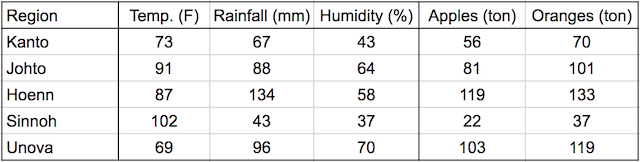
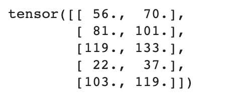

# PytorchNotebooks
This repo is made for learning PyTorch. I will be following [tutorial](https://youtu.be/GIsg-ZUy0MY) and save data as Jupyter Notebooks (also on Google Colab). Furthermore, there will be a quick summary of every chapter in this readme file.

## Table of Contents
- [Chapter 1: - Linear Regression](#chapter-1---linear-regression)

## Chapter 1: - Linear Regression
[[https://colab.research.google.com/drive/1MFDhnQZppdOlY0fiJsS6XZOB7lXuNAeZ?usp=sharing] or dowload this file. </br> 

Linear Regression is a method that uses a linear combination of variables and parameters to fit it to the model. In this section our task is to train model that will predict crops of apples and oranges with 3 parameters that have been affecting plantations. </br>
All that data is shown in the table below: </br>


Linear regression model's target variable is estimated to be a weighted sum of the input variables, offset by some constant, known as a bias :
```
yield_apple  = w11 * temp + w12 * rainfall + w13 * humidity + b1
yield_orange = w21 * temp + w22 * rainfall + w23 * humidity + b2
```
***Model*** is simply a function that performs a matrix multiplication of the `inputs` and the weights `w` (transposed) and adds the bias `b` (replicated for each observation). </br>
 </br>

Lets compare our model (initialized with random values) with targets from table. </br>
Predictions: </br>
 </br>
Targets: </br>


</br>
To better compare the model's predictions with the actual targets using the using **mean squared error** (MSE).</br>

At this point loss functions return value: 11598,41. This means that our model is accurate. </br></br>

The loss is a quadratic function of our weights and biases, and our objective is to find the set of weights where the loss is the lowest. If we plot a graph of the loss with reference to any individual weight or bias element, it will look like the figure shown below.  </br> An important insight from calculus is that the gradient indicates the rate of change of the loss, i.e., the loss function's slope with reference to the weights and biases.
</br></br>
If a gradient element is **positive**:

* **increasing** the weight element's value slightly will **increase** the loss
* **decreasing** the weight element's value slightly will **decrease** the loss
  
</br>

If a gradient element is **negative**:

* **increasing** the weight element's value slightly will **decrease** the loss
* **decreasing** the weight element's value slightly will **increase** the loss

</br>
We can subtract from each weight element a small quantity proportional to the derivative of the loss with reference to that element to reduce the loss slightly. </br>
 
At this point after applying operations mentioned earlier, we are starting to get smaller loss value (5451,81 compared to 11598,41 that we have achieved at the beginning). </br>

To reduce the loss further, we can repeat the process of adjusting the weights and biases using the gradients multiple times. Each iteration is called an **_epoch_**.</br>
Now value of loss functions is 111.38. </br>

Now lets compare predictions and target once more. </br>
Predictions: </br>
 </br>
Targets: </br>
 </br>
Similarity can be seen at this point.

Final step is to code all this using build-in PyTorch method. Lets compare predictions and targets last time (but now from build-in methods): </br>
Predictions: </br>
 </br>
Targets: </br>
 </br>
At this point result are very good. As we can see loss functions is just 7 and values in the predictions and targets are very similar. This means that our model is working properly.
